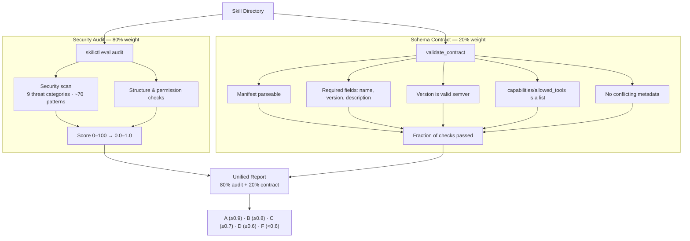

# Evaluation Suite

The `skillctl eval` commands grade skills A–F using **only deterministic
signals**. As of Milestone 0, the unified governance score is:

```
overall = 0.80 × security audit  +  0.20 × schema contract
```

Both inputs are pure functions of the skill's files — running `eval
report` N times on unchanged inputs yields the **identical** score. This
replaced the previous non-deterministic LLM-as-judge functional/trigger
evaluation, which is unsuitable for governance decisions that must be
reproducible and auditable.

> Behavioural testing (does the skill *help*? does it *trigger*?) is a
> valuable authoring activity, but it belongs in an authoring/testing
> workflow, not the governance gate. The optimizer that consumed those
> signals now lives in the separate `skillsops-optimize` package.

## Architecture



## Security Audit (80%)

Static analysis only — no LLM, no agent runtime. Scans for hardcoded
secrets, prompt injection, data exfiltration, unsafe deserialization,
encoded payloads, structural problems, and over-privileged capability
declarations. Produces a 0–100 score (normalized to 0.0–1.0 for the
unified report) and an A–F grade. A CRITICAL finding fails the skill.

See [docs/3-security-audit.md](3-security-audit.md) for the full finding
catalogue and suppression workflow.

## Schema Contract (20%)

Deterministic validation of the manifest contract. Each check is
pass/fail; the contract score is the fraction of checks that pass.

| Check | Required | What it verifies |
|-------|----------|------------------|
| `manifest_parseable` | yes | `skill.yaml` / `SKILL.md` frontmatter loads |
| `required_fields_present` | yes | `name`, `version`, `description` are all present |
| `version_valid_semver` | yes | version matches MAJOR.MINOR.PATCH |
| `allowed_tools_is_list` | no | declared capabilities is a list |
| `no_conflicting_metadata` | no | content ref isn't both `path` and `inline` |

The contract **passes** when every *required* check passes. A failing
required check fails the overall report.

### MVP schema

Required fields:

```yaml
name: string
version: string   # semver
description: string
```

Optional fields (progressive enhancement): `allowed_tools` / `capabilities`,
`constraints`, `category`, `compatibility`, `experimental`.

## Unified Report

```
Base weights: audit = 80%, contract = 20%

If a component is skipped (--skip-audit / --skip-contract), its weight is
redistributed to the remaining component so the score still spans 0.0–1.0.

Example: audit only            → audit = 100%
Example: contract only         → contract = 100%
Example: both (default)        → audit = 80%, contract = 20%
```

## CLI

```bash
# Security audit only (static analysis, no LLM)
skillctl eval audit ./my-skill
skillctl eval audit ./my-skill --include-all     # scan entire tree

# Deterministic unified report (80% audit + 20% contract)
skillctl eval report ./my-skill
skillctl eval report ./my-skill --format json
skillctl eval report ./my-skill --format html
skillctl eval report ./my-skill --skip-contract  # audit only
skillctl eval report ./my-skill --skip-audit      # contract only

# Regression testing against a saved baseline
skillctl eval snapshot ./my-skill
skillctl eval regression ./my-skill
```

## Module Map

| Module | Responsibility |
|--------|----------------|
| `skillctl/eval/cli.py` | Audit orchestration + eval subcommand dispatch |
| `skillctl/eval/audit/security_scan.py` | Secret / injection / exfil pattern detection |
| `skillctl/eval/audit/structure_check.py` | Frontmatter, naming, size validation |
| `skillctl/eval/audit/permission_analyzer.py` | Capability over-privilege detection |
| `skillctl/eval/contract.py` | Deterministic schema-contract checks (NEW) |
| `skillctl/eval/unified_report.py` | 80/20 weighted aggregation, letter grading |
| `skillctl/eval/regression.py` | Baseline snapshot and degradation detection |
